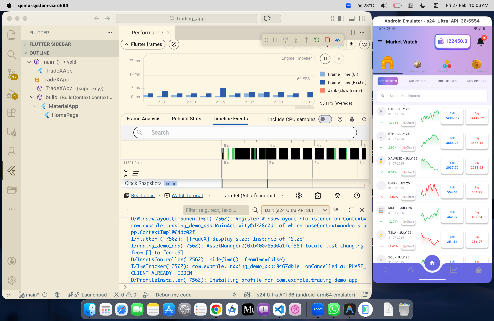
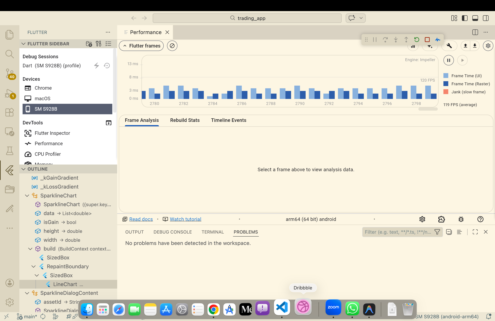

# SR — Flutter Trading Demo

A demo trading app built with Flutter that simulates live market prices updating every 500 ms. It demonstrates Clean Architecture, BLoC state management, and 60 fps rendering techniques.

---

## Getting started

```bash
flutter pub get
flutter run
```

---

## Project structure

```
lib/
 ├── core/
 │    ├── constants/
 │    ├── theme/
 │    ├── utils/
 │
 ├── features/
 │    └── trading/
 │         ├── data/
 │         │     ├── models/
 │         │     ├── repositories/
 │         │
 │         ├── domain/
 │         │     ├── entities/
 │         │     ├── repositories/
 │         │     ├── usecases/
 │         │
 │         ├── presentation/
 │         │     ├── bloc/
 │         │     ├── pages/
 │         │     ├── widgets/
 │
 └── injection_container.dart
```

---
## State Flow

UI (TradingPage)
        ↓
TradingBloc (Event)
        ↓
UseCase (GetUpdatedPrice)
        ↓
Repository (DummyTradingRepository)
        ↓
Bloc emits new TradingState
        ↓
UI rebuilds automatically

## Architecture

The app follows **Clean Architecture** with three layers per feature.

```
Presentation  →  Domain  ←  Data
(BLoC, pages,    (entities,   (datasources,
 widgets)         use cases,   repositories)
                  interfaces)
```

- The domain layer has no Flutter or third-party imports — it owns the interfaces, entities, and use-case contracts.
- Data-layer classes (datasources, repository implementations) are only imported in `injection_container.dart`.
- BLoCs depend on abstract use-case interfaces. Swapping a local datasource for a real API requires only registering a new class in the injection container.

---

## SOLID principles applied

| Principle | Where |
|-----------|-------|
| **Single Responsibility** | Each BLoC handles one feature; each widget does one visual job; each use case does one operation |
| **Open / Closed** | Add a new sort type by adding an enum value — no existing handler changes. Add caching by composing a new datasource |
| **Liskov Substitution** | Any class implementing `MarketRepository` or `MarketDataSource` can replace the local version without touching callers |
| **Interface Segregation** | Four narrow use-case interfaces (`FutureUseCase`, `FutureNoParamsUseCase`, `StreamUseCase`, `StreamNoParamsUseCase`) instead of one fat one |
| **Dependency Inversion** | BLoCs never import data-layer classes. Only `injection_container.dart` knows about concrete implementations |

## Dummy Trading Logic (Frontend Simulation)

This application simulates real-time trading price fluctuations using pure frontend logic without any external APIs. 
newPrice = oldPrice ± (oldPrice * changePercent)
default duration 500ms
The goal was to mimic real market behavior while keeping the logic clean, scalable, and fully managed via BLoC

## Performance

### 🏠 60FPS in emulator


### 📊 120FPS in real device


---

## Key packages

| Package | Purpose |
|---------|---------|
| `flutter_bloc` | BLoC state management |
| `equatable` | Value equality for states and events |
| `get_it` | Service locator / dependency injection |
| `fl_chart` | Line chart and pie chart |
| `intl` | Number formatting |
| `svg_flutter` | SVG icon rendering |
| `animated_bottom_navigation_bar` | Notched bottom nav |
